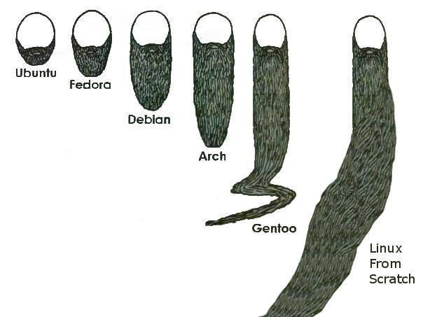

# Table of Contents
  1. [History](#history)
      1. [GNU/Linux Philosophy](#history--philosophy)
      1. [GNU/Linux Distributions](#history--distributions)
  1. [Commands](#commands)
      1. [Man pages](#commands--man)
      1. [Directories](#commands--directories)
      1. [Files](#commands--files)
      1. [File contents](#commands--filecontents)
      1. [File tree](#commands--filetree)
  1. [Users](#users)
  1. [Groups](#groups)
  1. [Permissions](#permissions)
  

## History

<a name="history--philosophy"></a><a name="1.2"></a>
> Based on years of conversations, I am convinced that part of the cause of the problem is the tendency to call the system Linux rather than GNU, and describe it as open source rather than free software.
> -- Richard Stallman


What is GNU? GNU is a recursive acronym for "GNU's Not Unix!"

The GNU is a system that is used every day by many people all of the world. Although many users refer to it by name "Linux" without knowing that it is GNU system that they actually use.

Linux is just a part of this system. It is a kernel:
the program in the system that allocates the machine's resources to the other programs that user runs.

So instead of sounding smart and showing off let's be really smart and know things in their right ways.

You can read about GNU project following these links:

[The GNU Manifesto](https://www.gnu.org/gnu/manifesto.html)

[What is free software?](https://www.gnu.org/philosophy/free-sw.html)

[Philosophy](https://www.gnu.org/philosophy/philosophy.html)

- `Do one thing and do it well`
- `Release early, release often `
- `Free as in Freedom (the GNU philosophy)`

<a name="history--distributions"></a>
#### GNU/Linux Distributions

  A GNU/Linux distribution is an operating system made from a software collection, which is based upon the Linux kernel and, often, a package management system.
      Widely used distributions are:

  **Debian**
  - `Ubuntu, a desktop and server distribution derived from Debian`
  - `Linux Mint Debian Edition`
  - `Linux Mint, a distribution based on and compatible with Ubuntu`

  **Fedora**
  - `Red Hat Enterprise Linux (RHEL)`
  - `CentOS, a distribution derived from the same sources used by Red Hat`

  **Arch Linux**
  - `Manjaro Linux`

  **Gentoo**
  - `Chrome OS, Google's commercial operating system`

You may find and use other distributions.
Each one will have its installation guide, just follow the steps and you'll be fine.
You don't need to be a hacker to install an Ubuntu on your machine.
Though consider which distribution suits your needs best.

##### Which one to choose ?

Distribution name | Reason(s) for using
------------ | -------------
Red Hat Enterprise (RHEL) | You are a manager and you want a good support contract.
CentOS| You want Red Hat without the support contract from Red Hat.
Fedora | You want Red Hat on your laptop/desktop.
Linux Mint | You want a personal graphical desktop to play movies, music and games.
Debian | Good for servers, laptops, and any other device.
Ubuntu | Good for new users. Has a new release each 6 months.
Kali | Designed for digital forensics and penetration testing. Good for hacking (they say).
others | Advanced users may prefer Arch, Gentoo, OpenSUSE, Scientific, etc.



Some useful links:

- [distrowatch](https://distrowatch.com/)
- [Red Hat](https://www.redhat.com/en)
- [Debian](https://www.debian.org/)
- [Linux Mint](https://www.linuxmint.com/)
- [Ubuntu](https://www.ubuntu.com/)
- [Gentoo](https://www.gentoo.org/)

**[⬆ back to top](#table-of-contents)**

## Commands

<a name="commands--man"></a><a name="2.1"></a>
#### Man pages
Have you ever came across RTFM? It's an initialism for the expression "read the fucking manual".
Everything (well, almost) could be found in manuals. But you may use search engines too.

Type `man $command_name` to get information about the command. Let's get information about `man` command itself.

```bash
man man
```

Go ahead and read more about `man` command in your terminal.

By the way, the second thing I tried with man command was:

``` man woman ```

And I got "No manual entry for woman". Well, I guess manual pages too can't have answers sometimes.

<a name="commands--directories"></a><a name="2.2"></a>
#### Directories

##### pwd

This command displays your current directory. Open a command line (terminal) and type `pwd` there.


##### cd

This command allows you to change your current directory.

```bash
cd /home/user/directory_name
```

Type `cd` without a target directory or as `cd ~` and you'll be in your home directory.

Type `cd ..` to go to the directory above your current directory(i.e. parent directory).

Type `cd -` to go to the previous directory.


##### absolute and relative paths

You should be aware of absolute and relative paths in the file tree.

When you type a path starting with a slash (/), then the root of the file tree is assumed.

If you don't start your path with a slash, then the current directory is assumed as the starting point.

For example if I'm in my `home` directory and I want to navigate to the `marvin` directory there, I need to type either

```bash
cd /home/marvin
```

or

```bash
cd marvin
```

##### path  completion

Use the tab key to type paths without errors as it completes paths. It will also save your time.

##### ls

This command lists the contents of a directory you are in.

Type `ls -a` to see all files, including the hidden files.
When a file name starts with a dot, it is considered a hidden file and it doesn't show up in regular file listings.

##### mkdir

This command let's you create directories.
You have to give the name of the new directory to be created.

```bash
mkdir mydir
```

This will create directory in your current directory.
Give absolute path to create anywhere else.

```bash
mkdir /home/user/some_dir_name_/mydir
```

Type `mkdir -p dir_name/sub_dir_name` to create both dir_name and sub_dir_name directories if dir_name does not exist yet.

##### rmdir

This command let's you remove a directory.

Type `rmdir -p` to remove directories recursively.


##### Practice

1. Display your current directory.
2. Change to the `/etc` directory.
3. Now change to your user directory (this could have different name for each of you) in home directory.
4. Go to the parent directory of the current directory.
5. List the contents of the current directory.
6. List all the files (including hidden files) in your `/etc` directory.
7. Create a directory `test_dir` in your home directory.
8. Change to the `/etc` directory, stay here and create a directory `new_dir` in your home
directory.
9. Create in one command the directories `~/dir1/dir2/dir3` (dir3 is a subdirectory from dir2,
10. Remove the directory `test_dir`.
11. Remove the directories `dir1`, `dir2`, `dir3` with one command.
12. Read about `lsof` command for the next session.


<a name="commands--files"></a><a name="2.3"></a>
#### Files

Some key points to remember about files:
- They are case sensitive. This means that test1 is different from Test1

- Everything  is  a  file. Directories too, they are special kind of files but still are fils.
Each console window, any hard disk or partition and any process are all represented somewhere in the file system as a file.

- File extensions are not used to determine the file type. Use file command to determine the file type.

```bash
file /home
```

will output as `/home: directory`


##### touch
To create an empty file we can use `touch` command.

##### rm

This command is used to remove a file.
This command removes a file permanently. Be careful when using this command.

The `rm -rf` command will erase anything, if you have proper permission.
Be very careful with `rm -rf` when you are logged in as a root user.
You can mess up everything and regret about what you have done.

##### cp

This commands let's you copy a file. Pass source and a target arguments to it.

```bash
cp original_file original_file.copy
```

If the target argument is a directory, then the original file is copied to that directory.

Type `cp -r` to copy complete directories. The `-r` option is used with some commands to do the task recursively,


##### mv

This command let's you rename a file or move the file to another directory.
It also can be used to rename directories, as directories are also files.


##### lsof

This command lists open files.

Open files in the system include disk files, named pipes, network sockets and devices opened by all processes.

This command can be used to list processes working on some port or vise versa.

To view the port associated with a daemon

```bash
lsof -i -n -P | grep firefox
```


To view which processes use port `443`

```bash
lsof -i :443
```

<a name="commands--filecontents"></a><a name="2.4"></a>
#### File contents

##### head

##### tail

##### cat

##### tac

##### more and less

##### strings

<a name="commands--filetree"></a><a name="2.5"></a>
#### File tree

##### filesystem hierarchy standard

##### man hier

##### the root directory  /

##### binary directories

##### configuration  directories

##### data  directories

##### in  memory   directories

##### /usr  Unix  System  Resources

##### /var  variable  data

     
**[⬆ back to top](#table-of-contents)**

## Users

<a name="users--intro"></a><a name="3.1"></a>
#### Intro

##### whoami

The `whoami` command tells you your username.

##### who

The `who` command will give you information about who is logged on the system.

##### w

The `w` command shows you who is logged on and what they are doing.

##### id

The `id` command will give you your user id, primary group id, and a list of the groups that you belong to.

##### su to another user

The  su command allows a user to run a shell as another user.
You can also su to become root, when you know the root password.

```bash
su root
```

<a name="users--profiles"></a><a name="3.2"></a>
#### User profiles

##### system  profile

##### ~/.bash_profile
      
## Groups

<a name="groups--intro"></a><a name="4.1"></a>
#### Groups

##### groupadd

##### usermod

##### groups


**[⬆ back to top](#table-of-contents)**

## Permissions

<a name="permissions--file"></a><a name="5.1"></a>
#### File permissions

##### file ownership

##### list of special files

##### permissions

**[⬆ back to top](#table-of-contents)**

